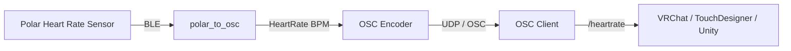

# Polar to OSC

**Polar to OSC** is a lightweight Rust tool that bridges **Polar heart rate sensors** to **OSC (Open Sound Control)**.

It connects to a Polar device over Bluetooth Low Energy (BLE), listens for real-time heart rate updates, and broadcasts them via OSC, making it easy to integrate biometric data into creative tools, games, and interactive environments such as **VRChat**, TouchDesigner, Max/MSP, or Unity.

---

## ✨ Features

* 🔗 Connects to Polar BLE heart rate devices
* ❤️ Streams live heart rate (BPM) data
* 📡 Sends data over OSC via UDP
* ⚡ Low-latency, real-time updates
* 🦀 Written in Rust (fast, minimal, reliable)

---

## 📦 OSC Output

The application sends OSC messages with the following format:

**Address**

```
/heartrate
```

**Arguments**

```
int32 — BPM (beats per minute)
```

**Example**

```
/heartrate 72
```

---

## 🛠 Requirements

* A compatible **Polar heart rate sensor**
* Bluetooth Low Energy (BLE) support
* Rust toolchain (`cargo`, `rustc`)
* Linux, macOS, or Windows with BLE support

---

## 🚀 Usage

```
polar_to_osc DEVICE_ID HOST_IP:HOST_PORT CLIENT_IP:CLIENT_PORT
```

### Arguments

| Argument              | Description                          |
| --------------------- | ------------------------------------ |
| DEVICE_ID             | Polar device ID (e.g. `B97DCF60`)    |
| HOST_IP:HOST_PORT     | Local address to bind the UDP socket |
| CLIENT_IP:CLIENT_PORT | Destination OSC client address       |

---

### Example

Send heart rate data to **VRChat** (default OSC port `9000`):

```
polar_to_osc B97DCF60 127.0.0.1:2222 127.0.0.1:9000
```

This will continuously stream BPM updates to:

```
/heartrate
```

---

## 🔄 Data Flow



---

## 🧠 How It Works

1. Connects to the Polar device using Bluetooth LE
2. Subscribes to heart rate notifications
3. Receives BPM updates in real time
4. Encodes the data as an OSC message
5. Sends the message via UDP to the configured client

---

## 📚 Built With

* **arctic** – Polar BLE communication
* **rosc** – OSC encoding
* **tokio** – Async runtime

---

## ⚠️ Notes

* Ensure no other application is connected to the Polar device
* Bluetooth adapters must support BLE
* The OSC client must be listening on the target port

---

## 📄 License

MIT License — free to use, modify, and integrate into your own projects.
